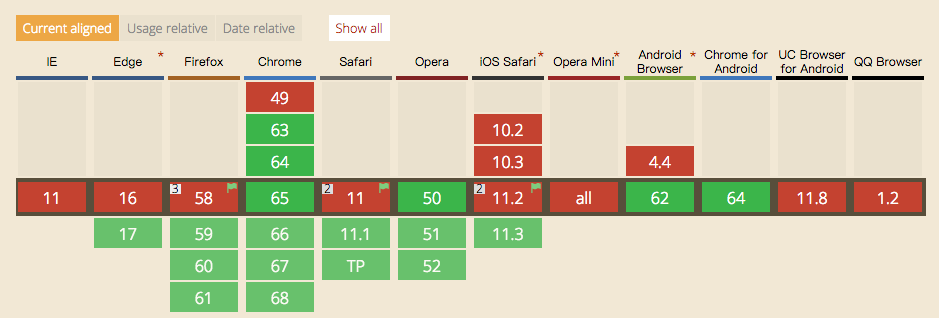

async、defer、preload区别

示例：

~~~html
<html>
<head>
    <link rel="stylesheet" type="text/css" href="/style.css">
    
</head>
<body>
  
Text

  
</body>
</html>
~~~

这里解析过程是：

1、开始解析html

2、遇到css暂停解析，然后下载css并解析，

3、接着遇到js暂停html解析，然后下载js并解析

4、继续解析html

5、遇到main.js，暂停解析html，下载js并解析

6、完成html解析

###preload
当设置preload时候，浏览器不会暂停html解析，但是会加载资源。

支持的类型包括img、js、css、font、audio、video、fetch

~~~html
<link rel="preload" herf="style.css" as="style">
<link rel="perload" herf="main.js" as="script">
<link rel="preload" href="bg-image-wide.png" as="image" media="(min-width: 601px)">
<link rel="preload" href="fonts/cicle_fina-webfont.ttf" as="font" type="font/ttf" crossorigin="anonymous">
~~~
> 这里只是把资源加载进来，并没有对文档产生影响，比如里面定义的class和变量是获取不到。
> 
> 加载跨域的资源的需要设置：crossorigin

直到真正需要使用的时候再正常引入

~~~html
<link rel="stylesheet" href="style.css">

~~~

###自由控制
控制资源什么时候加载什么时候解析，通过脚本来完成：

~~~javascript
var preloadLink = document.createElement("link");
preloadLink.href = "myscript.js";
preloadLink.rel = "preload";
preloadLink.as = "script";
document.head.appendChild(preloadLink);
~~~
这里只是预加载并不执行，当需要执行的时候可以：

~~~javascript
var preloadedScript = document.createElement("script");
preloadedScript.src = "myscript.js";
document.body.appendChild(preloadedScript);
~~~

兼容性：

> 手机端目前兼容性太差

###Prefetch
浏览器空闲之后下载， 也就是把预加载的权限开放给浏览器来决定。
但是有一个问题，当预加载未完成的时候，后面又引用需要的资源，这个时候浏览器会两次加载。

~~~html
<link rel="prefetch" href="style.css" />
~~~

###async、defer
基本上所有的大的互联网首页都有对这两个属性的应用，到底有什么用。用于在不阻塞页面文档解析的前提下，控制脚本的下载和执行，流程和解析：

可以看到当设置defer时，先会加载然后等待HTML解析完成后在解析js。
设置async时，先加载然后加载完成后就立刻解析js，这个时候会中断html解析。等解析完成js后再继续HTML解析。

兼容性：

###dns-prefetch
提前给域名解析，提升加载速度。

合理的应用dns-prefetch可以加快整个商户度50ms-300ms.

* 浏览器会对页面中包含的link、href的域名自动dns-prefetch。（对https不起作用，需要手动开启）

~~~html
<meta http-equiv="x-dns-prefetch-control" content="on" >
~~~

* 需要手动添加link标签的场景是：你预计用户在后面的访问中需要用到当前页面的所有链接都不包含的域名

> 查看chrome中域名预解析情况：chrome://dns/或者chrome://histograms/DNS
