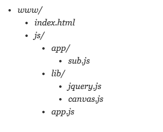

##说明
#### 历史：
		
	
	
	
#### 问题：

1. 阻塞页面渲染。
2. 因为js之间依赖关系，必须按照顺序加载，后期维护起来费工夫

#### RequireJs作用：
1. 实现js文件异步加载，避免网页失去响应 
2. 管理模块之间的依赖性，便于代码维护和编写。

一般实现异步加载js的方法

	
	//加defer是为了兼容IE浏览器，IE不支持async属性

## 基本使用

### 页面引用

	
data-main表示的是主模块的意思，一般requirejs加载完成，就就加载主模块，一般有两个用途：

1. 定义配置文件
2. 加载第一个应用模块

### 加载文件

	require(["js/a"])
	
这里表示根据当前文件目录来说，加载js目录下面的a.js文件

#### 基本配置

加载文件

	require.config({
		paths: {
			a : "js/a"
		}
	})

### 官方目录结构

### 两个基本方法

#### require

#### define

## 高级配置

### 加载未标准定义文件

单个方法
	
	 //singleFn.js
	 function a () {
	 	console.log("show a fn");
	 	}

多个方法
	

## 常见问题

## 项目建设建议

---
	
			
			