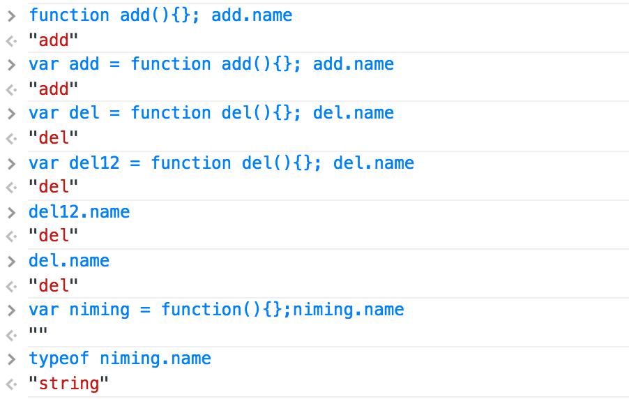

##第四章 函数

###4.1 背景

函数是js中使用率最高的一个对象，万物皆对象。函数也不例外，只是这个对象和别的对象来说有几个特别的特性，“执行”是其中一个。

另外两个特性包括：是一个一等对象，提供作用域的支持。

js本身有两种作用域，一种是全局的作用域，比如window，还有一个就是局部作用域，比如函数内用var声明的作用域，函数内用if或者for等内部声明的作用域还是属于函数内部的作用域，不属于if内部的作用域。
 
函数既然也是对象，那么就会一样会有对象的一些特性，比如有 **属性** 和 **方法**。

####函数的中的匿名函数和命名函数之间的区别：

匿名函数的name属性值是一个空字符串，命名函数的name值是有值的。这是他们唯一的区别。
真正有三种术语方面的说法：带有命名的函数表达式、无名字的函数表达式、函数声明

	var add = function add(){}; //带有命名的函数表达式,末尾必须要有分号
	
	var add = function (){};  //无名字的函数表达式
	
	function add(){}; //函数声明，末尾可以不用分号

>“函数直接量”这个概念一般用来表示函数表达式或者匿名函数表达式，尽量不要用，有歧义。

###4.2 函数提前

前面有过叫做变量提前的说法，也就是在运行环境中，变量始终会方便开始，即使是后面定义的也是如此。函数也有提前这一说法，因为函数也是一种对象，赋值给了变量。

“函数声明”定义的函数不仅能够让函数**定义**提前，还能够让声明提前。

	function foo(){console.log("foo")}
	function bar(){console.log("bar")}
	
	function next(){
	
		//next 内部的foo和bar会覆盖全局的foo和bar
	
		console.log(typeof foo);  //function 因为foo是一个函数声明
		console.log(typeof bar);  //undefined  bar是一个无名的函数表达式
		
		foo();  // new foo
		bar();  //typeError: bar is not a function 
		
		function foo(){
			console.log("new foo")
		}
		var bar = function(){
			console.log("new bar")			
		};
		console.log(typeof bar);  //function 
					
	}

### 4.3 回调模式

该模式应该是函数经常用到的一个方式，因为函数是对象，也就是说函数可以作为参数传递给另外一个函数，当给函数传入一个函数参数，并且在函数内调用了函数参数，并执行，称传入参数的函数叫回调函数，也成回调。
	function f(callback){
		
		callback();//执行了
	}		
	
	function cb(){
		console.log("回调");
	}	
	
	f(cb);// 回调

遍历节点并做一定动作，一般逻辑，把节点抛出来，并用方法隐藏，例如：
	
	//findNodes 方法找到节点并返回出来，
	 var findNodes = function(){
     	var nodeParent = document.getElementById("J_ul");
     	var nodes = nodeParent.getElementsByTagName("li");
    	return nodes;
     }
     
     //隐藏节点
    var hide = function(node){
    	var i=0, max = node.length; //遍历节点
    	for(; i < max; i++){
     	 node[i].style.display = "none";
    	}
    }
    
    //显示节点
    var show = function(node){
    	var i=0, max = node.length; //遍历节点
    	for(; i < max; i++){
      		node[i].style.display = "block";
    	}
    }
    
    //执行
    hide(findNodes());
    show(findNodes());
    
这里做一次操作就会遍历节点一遍，

	var findNodes = function(callback){
     var nodeParent = document.getElementById("J_ul");
     var nodes = nodeParent.getElementsByTagName("li");
     var length = nodes.length;
     
     //判断参数callback是不是函数
     if(typeof callback !== "function"){
      callback = false;
     }
     
     while(length){
      length--;
      if(callback){
        callback(nodes[length]);// 这是回调函数可以操作部分
      }
     }
     
     return nodes; //还是可以返回节点
     }
     var hide = function(node){
      node.style.display = "none";
      }
      var show = function(node){
      node.style.display = "block";
      }
      
      findNodes(hide);
      findNodes(show);
 
 这里hide方法和show方法已经不需要再去遍历一回节点，相当于操作和需要操作的数据分离，其实有点像数据和控制器分离，这样做到findNodes方法更加`通用`。

  
  
### 4.4 返回函数

> 函数是一个特殊变量，当有()的时候就是表示执行。执行完成之后就看有没有return，有的话就是这个函数返回出来的东西。

函数里面还可以返回函数，但是这首先是函数执行之后的返回，也就是必须()，如果只是变量之间转换，例如：var a=fn;这样a是没有得到fn的返回值。这个只是a引用了fn。

	var fn=function(){
		console.log(1);
		retunr function(){
		 console.log(2);
		}
	}
	var a=fn;
	var b=fn();
	console.log(typeof a); // function,这个时候a只是fn的引用。
	console.log(typeof b); // function，这个时候b是fn()执行完成之后的返回出来的function
	
 如果fn执行完成之后没有返回值，即使赋值到变量上，变量也是undefind;  
 	
 	 	var fn = function(){
 			console.log(1) 		
 		}   
 		var a = fn;
 		var b = fn();
 		console.log(typeof a); // function,这个时候a只是fn的引用。
		console.log(typeof b); // undefined，因为fn()执行完成之后没有返回值，所以b得到对结果就是undefined;
	
函数内部有一些私有的数据，在函数外部是访问不到，但是函数内部的函数是可以访问到，例如：

	var fn = function(){
		var count = 0; //该变量在fn外部访问不到，因为做用域的原因。
		return function(){
			count += 1; //这里可以访问到count，在函数内部。
		}
	}
	var a =fn();//这里执行过一次fn(),也就是初始化了一下count。
	a(); //当第一次执行a()时，count已经初始化一次，因为a函数是fn里面的，所以能够访问到count变量。这个时候执行返回出来的函数。这里执行了也就是＋1。
	a(); //2

> 这里有一个疑惑为什么第二次执行的时候不是1，而是2？

这里需要解释保存count为1的在哪里，这里就相当于开始的count=0,这是最开始的，也是执行一次就改变一次。这里可以理解count是相对返回的函数来说是一个全局变量。
例如：
	
	var count = 0;
	var add = function(){
		count += 1;
	}
	add();//这里每执行一次就改变全局变量count一次，只是前面那个例子是包含在一个函数内部。

### 4.5 自定义函数
覆盖自己的函数定义，可以初始化操作一次。

		var selfFn = function(){
			console.log("first");
			selfFn = funcition(){
				console.log("two");
			}
		}
		selfFn(); // first
		selfFn(); //two
这里是第一次执行的时候正常流程，并且把函数重新赋值到函数的名称，当第二次执行的时候，这个时候实际上，函数执行的内容已经覆盖开始到执行内容。函数被重定义。
函数是一个执行体，变量只是这个函数执行的引用。如果这个函数赋值给另外一个变量会怎样？

		var otherFn = selfFn;
		otherFn();
		otherFn();

### 4.6 自执行函数
一般这种函数是有一些只是执行一次，后面再也不执行了，并且可以保证在它里面的变量不会污染整个全局变量

		(function(){
			var who = "juzipi";
			console.log(who);
		})() //这里括号完成表示执行
		
		//另外一种方式
		(function(){
		//do something
		}())
		
也可以给自执行函数加上参数，如果参数是window这样如果在浏览器的环境可以访问到全局的内容。

		var who = 'juzipi';
		(function(w){
			console.log(w.who); //juzipi
		})(window)
> 为了通用型最好是不要用window作为参数，因为这个职能在浏览器的环境下执行

#### 立即执行函数返回值

立即执行的函数也是可以返回值的，和他们函数一样。

		var val = (function(){
			return 2+2;
		})()
		
		//可以省略括号
		
		var val = function(){
			return 2+2;
		}()
		
		//属性定义
		var obj ={
			m : (function(){
				var who = "me";
				var what = "call";
				return who +""+what;
			})(),
			getM : function(){
				return this.m;
			}
		}
		
		obj.m;  //me call
		obj.getM();  //me call
在这里m这个属性值实际上是一个字符串，而getM是一个方法，所以要执行后得到结果。

## 立即初始化对象
建立一个对象，并且运行对象方法，对象字面量方式建立对象

		({
			max : 2,
			min :1,
			add :function(){
				return max + min;
			},
			init : function(){
				return console.log(this.add());
			}
		}).init()
		//两种方式调用
		({}).init();
		({}.init());
		
其实就是建立对象直接执行方法，如果初始化工作比较复杂，建议用这种方式，这种方式，结构比较清楚，是一次性初始化。
但是这种方式在js压缩工作工具里面不是很友好。

## 条件初始化
当知道某种条件在整个程序生命周期不会发生改变，这样就是对这个条件进行一次初始化操作就好，使用最多的就是浏览器特性检测。一般来说浏览器对于某种特性的支持都是固定的，不会存在变化的可能。比如对于事件的添加删除。
原来我们经常会这样写：

		var U = {
			addFn : function(el,type,fn){
				if(typeof window.addEventListener == "function"){
					el.addEventListener(type,fn,false);
				}else if(typeof document.attachEvent == "function"){
					el.attchEvnet("on"+type, fn);
				}else{
					el["on"+type] = fn;
				}
			}
		}
但是这样效率不高，因为每次执行U.addFn()的时候都会去查一遍浏览器的特性，因为这个特性是固定的，所以不需要每一次都去查询一遍，只需要查询一次就可以。

		var U = {
			addFn : null
			}
			
		if(typeof window.addEventListener == "function"){
			U.addFn = functon(el,type,fn){
				el.addEventListener(type,fn,false);
			}
		}esle if(typeof doucment.attachEvent == "function"){
			U.addFn = function(el,type,fn){
				el.attchEvent("on"+type,fn)
			}
		}else{
			U.addFn = function(el,type,fn){
				el["on"+type] = fn; //这里说明一下，为什么用中括号形式，而是“.”形式，因为后面那种形式不能使用字符串相加的运算
			}
		}	
		
	
		

		
		

	

